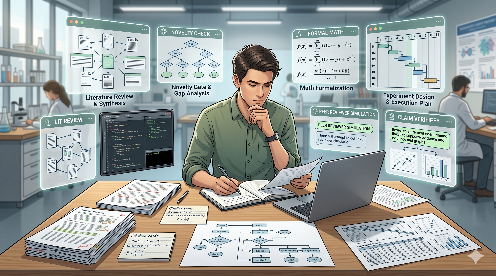
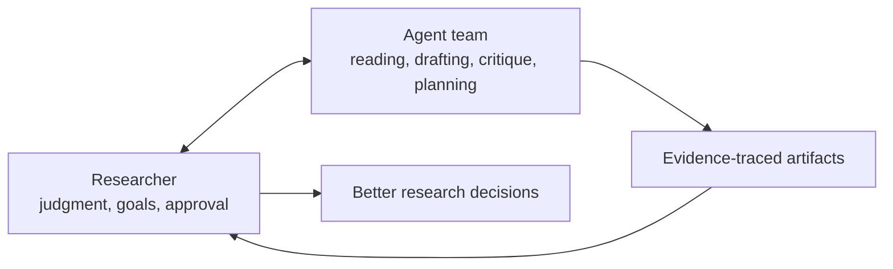
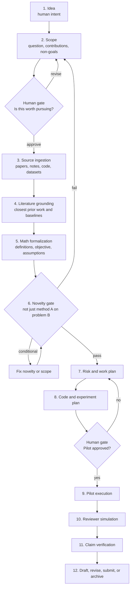
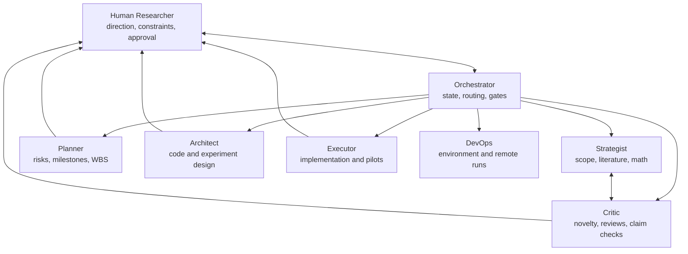

# Research Agent Skill

[](LICENSE)
[](SKILL.md)
[](.claude/commands)
[](references)
[](docs/PAGES_SETUP.md)
[](#quick-start)

**A human-guided research agent for Master and PhD students in technical fields such as computer science, AI, mathematics, and engineering.**



> Use agents to read deeper, think wider, plan better, and review harder while the researcher stays in control.

Research Agent Skill helps Master, PhD, and independent researchers in technical disciplines collaborate with AI agents across the research lifecycle: scoping, literature review, novelty checking, mathematical formalization, experiment planning, reviewer simulation, and claim verification.

It is not an autonomous paper factory. The goal is not to remove the researcher. The goal is to give researchers a disciplined collaboration workflow so they can learn faster, explore more ideas, challenge weak assumptions earlier, and complete research with stronger evidence.

## Why Students Use It

| Need | How the skill helps |
|---|---|
| Start from a rough thesis idea | Turns broad topics into scoped research questions, non-goals, and contribution options. |
| Read literature more systematically | Forces source inspection, evidence extraction, and grounding against closest prior work. |
| Process real papers at scale | Supports paper download, PDF-to-Markdown conversion, figure/table extraction, and source analysis matrices. |
| Avoid weak novelty | Runs a novelty gate before implementation or drafting consumes too much time. |
| Learn research structure | Makes assumptions, gates, reviewer risks, and decisions explicit. |
| Prepare experiments | Builds risk plans, work breakdowns, pilot criteria, and execution artifacts. |
| Write stronger claims | Verifies claims against sources, formal artifacts, or experiment results. |

## Who It Is For

- Master students learning how to structure a serious research project.
- PhD students managing literature, novelty, experiments, and writing pressure.
- Students in computer science, AI, machine learning, mathematics, engineering, and related technical fields.
- Research engineers turning rough ideas into executable experiments.
- Supervisors who want traceable AI-assisted research artifacts.
- Students and researchers who need a reusable research workflow.

## What's Included

| Area | Included |
|---|---|
| Skill entry | [`SKILL.md`](SKILL.md), [`CLAUDE.md`](CLAUDE.md), [`agents/openai.yaml`](agents/openai.yaml) |
| Commands | 16 prompt commands for scoping, ingestion, novelty, planning, review, and execution |
| References | Workflow, roles, source grounding, tool layer, novelty gate, experiments, language policy |
| Agent roles | Orchestrator, Strategist, Critic, Planner, Architect, Executor, DevOps |
| Examples | Topic brief and sample outputs for scope, literature grounding, novelty, and claims |
| Landing page | Static GitHub Pages site in [`docs/`](docs) |
| Visuals | Hero image, social preview, Mermaid diagrams, and image-generation prompts |

## Core Promise



The researcher provides direction, taste, constraints, and final judgment. The agents provide breadth, structure, critique, and execution support. Every important step creates an artifact that can be reviewed, revised, and learned from.

## What This Skill Does

- Turns rough ideas into scoped research questions and contributions.
- Forces source inspection before claims are used.
- Works with tool-assisted paper ingestion: download PDFs, convert them to Markdown, extract figures/tables, and build source analysis matrices.
- Grounds methods against closest prior work.
- Blocks shallow novelty with an explicit novelty gate.
- Requires mathematical definitions before implementation.
- Builds risk plans, work breakdowns, and code execution plans.
- Simulates reviewers before the paper is too expensive to fix.
- Verifies claims against sources or experiment artifacts.
- Supports configurable output language while keeping prompts stable in English.

## Tool-Assisted Paper Ingestion

This skill is designed for real research workflows where papers are processed with tools, not only pasted into chat.

| Tool layer | What it enables |
|---|---|
| Paper downloader | Collect PDFs from source lists, arXiv links, DOI pages, or curated reading lists. |
| PDF-to-Markdown converter | Turn dense PDFs into readable Markdown notes that agents can inspect and cite cautiously. |
| Figure/table extractor | Read captions, crop figures/tables, and analyze visual evidence that may not appear in plain text. |
| Source analysis matrix | Compare papers by problem, method, dataset, metric, result, limitation, and relevance. |
| Claim tracer | Link draft claims back to inspected sources, figures, tables, or experiment artifacts. |

See [references/tool_layer.md](references/tool_layer.md) for the expected output contracts.

## What This Skill Does Not Do

- It does not write a fake paper from thin air.
- It does not invent citations, datasets, baselines, or results.
- It does not replace advisor feedback or human research judgment.
- It does not guarantee acceptance at any venue.
- It does not claim full autonomy.

## Quick Start

Clone the repo into a research workspace used with Claude, ChatGPT, Gemini, local LLM agents, or another AI agent that can read repository instructions.

```bash
git clone <your-repo-url>
cd Academic-Research-Agent-Skill
cp config/language.example.yaml config/language.yaml
```

Then ask your assistant:

```text
Use SKILL.md and CLAUDE.md. Help me develop this research idea:
"My research topic here"
```

Recommended first sequence:

```text
/paper-scope
/pdf-ingest
/lit-ground
/math-formalize
/astar-novelty
/risk-plan
/code-exec-plan
/reviewer-sim
```

## Language Configuration

Prompts are written in English for consistency. Outputs can be localized.

```yaml
output_language: "Vietnamese"
secondary_language: "English"
translation_mode: "technical-terms-in-english"
```

See [docs/LANGUAGE_CUSTOMIZATION.md](docs/LANGUAGE_CUSTOMIZATION.md).

## Workflow



## Agent Collaboration Model



## Repository Map

```text
.
├── SKILL.md                   # Core skill entry point
├── CLAUDE.md                  # Agent session instructions
├── references/                # Skill references loaded when needed
├── .claude/commands/          # Slash-command style prompts
├── _agents/                   # Role contracts, rules, workflows
├── config/                    # Language configuration
├── docs/                      # User-facing documentation
├── examples/                  # Topic brief and sample output structure
└── assets/image-prompts/      # Prompts for generating repo visuals
```

## Why This Is Different

| Compared with | Difference |
|---|---|
| Fully autonomous paper generators | Human approval is a core design feature, not a fallback. |
| General deep research tools | Focuses on academic contribution shaping, novelty, formalization, and review. |
| Prompt collections | Defines roles, gates, artifacts, and traceability rules. |
| Literature-only assistants | Connects literature to math, experiments, implementation, and claims. |

## Expected Artifacts

- `02_Scope.md`
- `05_Lit_Grounding.md`
- `06_Math_Formalization.md`
- `10_Risk_Plan.md`
- `11_WorkBreakdown.md`
- `12_Code_Execution_Plan.md`
- `14_Agent_Brief_PhaseN.md`
- `15_Changelog.md`
- `19_Source_Analysis_Matrix.md`
- PDF-to-Markdown notes, figure/table reports, and download logs when tool-assisted ingestion is used
- Reviewer simulation and claim verification report

## Visual Assets

The repository includes Mermaid diagrams and image-generation prompts:

- [docs/visuals/human_agent_collaboration.mmd](docs/visuals/human_agent_collaboration.mmd)
- [docs/visuals/research_lifecycle.mmd](docs/visuals/research_lifecycle.mmd)
- [docs/visuals/artifact_pipeline.mmd](docs/visuals/artifact_pipeline.mmd)
- [assets/image-prompts/README.md](assets/image-prompts/README.md)

## Documentation

- [Getting Started](docs/GETTING_STARTED.md)
- [Research Tools](docs/TOOLS.md)
- [Positioning](docs/POSITIONING.md)
- [Use Cases](docs/USE_CASES.md)
- [Language Customization](docs/LANGUAGE_CUSTOMIZATION.md)
- [Visual Guide](docs/VISUAL_GUIDE.md)
- [Image Generation Guide](docs/IMAGE_GENERATION.md)
- [Competitive Analysis](docs/COMPETITIVE_ANALYSIS.md)
- [Launch Checklist](docs/LAUNCH_CHECKLIST.md)

## Recommended GitHub Description

```text
Human-guided Research Agent Skill for Master/PhD students in CS, AI, math, and engineering: literature grounding, novelty gates, math formalization, experiment planning, reviewer simulation, and claim verification.
```

## Safety Position

Research Agent Skill is designed for evidence-traced collaboration. If a claim cannot be linked to an inspected source, formal artifact, or experiment result, it must be labeled as a hypothesis or removed.

## Citation

If you use this repository in academic work, cite it as a human-guided research agent skill for Master and PhD students in technical fields.
